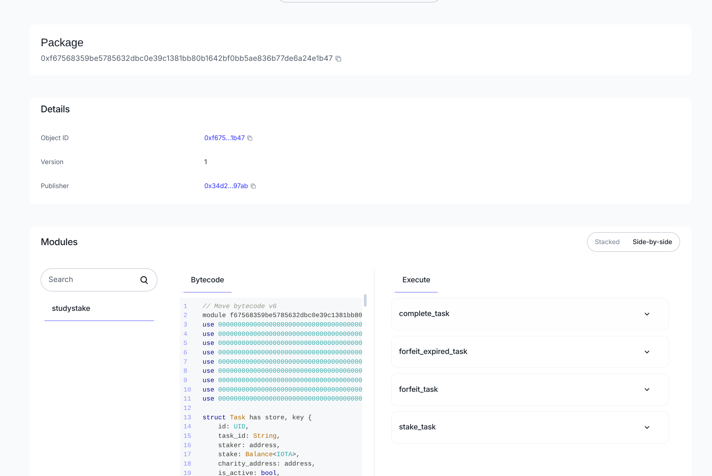

# Study Stake - Accountability-Based Productivity dApp

**Study Stake** is a hybrid productivity system that combines time-commitment tracking with financial stakes on the IOTA blockchain to enforce discipline and build accountability.




## 🎯 Features

- **Dual-Mode Task System**
  - **Free Mode**: Limited daily sessions with no financial commitment (2 free sessions per day)
  - **Stake Mode**: Put IOTA tokens on the line to stay accountable

- **Tab Visibility Tracking**: Automatically detects when you leave the tab during a task
  - 30-second grace period with warning before forfeiture
  - 20-second warning notification to return to task
  - Ensures genuine focus and accountability

- **Charity Integration**: Choose where your forfeited stakes go
  - 8+ verified charitable organizations across multiple categories
  - Children & Education, Humanitarian Aid, Healthcare, Environment, Economic Development
  - 100% of forfeited stakes donated to your selected charity

- **IOTA Wallet Integration**: Seamless blockchain connectivity using IOTA SDK
  - Secure wallet connection
  - Native IOTA token staking
  - Transaction history on-chain

- **Local Progress Tracking**: Task history and stats saved locally
  - Streak counter (resets on forfeit)
  - Discipline score (5 points for free mode, 10x stake amount for stake mode)
  - Completed task history (last 50 tasks)
  - Daily free session reset
  - Future: Direct blockchain explorer integration with TanStack Query

- **Real-Time Leaderboard**: Competitive rankings based on on-chain performance
  - Automatic indexing of Move events from IOTA blockchain
  - Points awarded for completed tasks based on stake amount
  - Top 10 rankings display with trophy badges
  - Auto-refreshes every 30 seconds for live updates
  - Shows total participants, tasks completed, and total IOTA staked
  - Caching for optimal API performance

- **Neobrutalism UI**: Bold, accessible design with high contrast and clear visual hierarchy
  - Dark mode support
  - Responsive layout for mobile and desktop
  - Custom brutalist shadow effects

## 🏗️ Architecture

### Frontend
- **Framework**: Next.js 15+ with React 19
- **Styling**: Tailwind CSS 4.1 with custom neobrutalism design system
- **UI Components**: Radix UI primitives with custom styling
- **State Management**: React hooks with localStorage persistence
- **Blockchain**: IOTA SDK (@iota/iota.js, @iota/iota-sdk) for wallet and contract interaction
- **Forms**: react-hook-form with Zod validation

### Smart Contract
- **Platform**: IOTA Move
- **Language**: Move (not Solidity!)
- **Network**: IOTA Testnet (for development)
- **Functions**:
  - `stake_task`: Create a staked task commitment
  - `complete_task`: Retrieve your stake upon successful completion
  - `forfeit_task`: Send stake to charity if task failed or abandoned

### Contract Architecture
The Move contract uses an object-centric model where each Task is an owned object:
- Tasks are transferred to the staker upon creation
- Staker must own the Task object to complete or forfeit it
- No global mapping - each task is a separate on-chain object
- Events emitted for all major actions (TaskStaked, TaskCompleted, TaskForfeited)

## 📦 Installation

### Prerequisites
- Node.js 18+ and pnpm
- IOTA CLI for smart contract deployment
- IOTA wallet (browser extension or compatible wallet)
- Rust and Cargo (for building IOTA CLI)

### Frontend Setup

```bash
cd discipline-app-mvp
pnpm install
```

### Environment Variables

Create a `.env.local` file in `discipline-app-mvp/`:

```env
NEXT_PUBLIC_IOTA_NETWORK=testnet
NEXT_PUBLIC_IOTA_RPC_URL=https://api.testnet.iota.org:443
NEXT_PUBLIC_PACKAGE_ID=0xf67568359be5785632dbc0e39c1381bb80b1642bf0bb5ae836b77de6a24e1b47
```

**Note**: Update the charity wallet addresses in `lib/charities.ts` with real IOTA addresses after deployment.

### Run Development Server

```bash
pnpm dev
```

Visit `http://localhost:3000`

## 🚀 Smart Contract Deployment

### Install IOTA CLI

```bash
# Install Rust if you haven't
curl --proto '=https' --tlsv1.2 -sSf https://sh.rustup.rs | sh

# Install IOTA CLI
cargo install --locked --git https://github.com/iotaledger/iota iota
```

### Build the Contract

```bash
cd smart-contract
iota move build
```

### Deploy to Testnet

First, configure your IOTA client for testnet:

```bash
iota client new-env --alias testnet --rpc https://api.testnet.iota.org:443
iota client switch --env testnet
```

Request testnet tokens:
```bash
iota client faucet
```

Deploy the contract:
```bash
iota client publish --gas-budget 100000000
```

After deployment, you'll see output like:
```
----- Transaction Effects ----
Status : Success
Created Objects:
  - ID: 0xPACKAGE_ID_HERE , Owner: Immutable
```

Copy the **Package ID** and update your `.env.local` file.

### Verify Deployment

```bash
iota client object <PACKAGE_ID>
```

### Run Contract Tests

```bash
cd smart-contract
iota move test
```

## 🎮 Usage

### 1. Connect Your Wallet
Click "Connect Wallet" in the dashboard header to link your IOTA wallet.

**Note**: In the current implementation, wallet connection is simulated. For production, integrate with an actual IOTA wallet adapter.

### 2. Create a Task

**Free Mode:**
1. Click "Start New Task"
2. Enter task name (e.g., "Study Calculus")
3. Select category (Study, Work, Health, Chores, Personal)
4. Set duration (10-120 minutes)
5. Select "Free Mode"
6. Click "Start Task"

**Limitations**: 2 free sessions per day, resets at midnight

**Stake Mode:**
1. Click "Start New Task"
2. Enter task details
3. Select "Stake Mode"
4. Enter stake amount (minimum 0.1 IOTA)
5. Choose a charity from the dropdown (filter by category)
6. Review: "Fail → Donated to charity | Success → 100% returned"
7. Click "Start Task"
8. Confirm the blockchain transaction in your wallet

### 3. Complete Your Task
- Timer counts down from your set duration
- Progress bar shows completion percentage
- **Keep the tab open!** Tab visibility is tracked
- If you switch tabs:
  - ⚠️ Warning after 20 seconds
  - ❌ Automatic forfeit after 30 seconds (stake donated to charity)
- Upon timer completion:
  - Submit proof (text description or future: photo)
  - Receive your stake back (Stake Mode)
  - Increment streak and earn discipline points (both modes)

### 4. Track Your Progress
- **Streak Counter** (🔥): Consecutive completed tasks (resets on forfeit)
- **Discipline Score** (🏆): Cumulative points earned
  - Free mode: +5 points per task
  - Stake mode: +10 points per IOTA staked
- **Task History**: View last 50 completed/forfeited tasks with details

### 5. View the Leaderboard
The real-time leaderboard shows the top performers based on on-chain task completions:
- **Top 10 Rankings**: Displays the highest-scoring users with trophy badges (🥇🥈🥉)
- **Your Rank**: Shows your current position if you're not in the top 10
- **Points System**: Earn points equal to your staked IOTA amount when completing tasks
- **Live Updates**: Leaderboard auto-refreshes every 30 seconds
- **Manual Refresh**: Click the "Refresh" button to update rankings instantly
- **Participant Stats**: View total participants, tasks completed, and total IOTA staked

**How Points Are Calculated:**
- Only completed tasks earn points (forfeited tasks = 0 points)
- Points = staked amount in nano IOTA (e.g., 1 IOTA stake = 1,000,000,000 points)
- Task completions are indexed from Move events on the blockchain
- Rankings update automatically as users complete tasks

## 🔐 Security Considerations

- Smart contracts are **non-upgradeable** once deployed to mainnet
- All transactions require wallet signature confirmation
- Stake amounts are held in the Move contract's Balance until task completion or forfeiture
- Tab tracking runs **client-side** (requires user to keep app open honestly)
- Private keys never leave the wallet extension
- Contract validates all inputs (charity address, stake amount, ownership)

## 🧪 Testing

### Frontend Tests
```bash
cd discipline-app-mvp
pnpm test
```

### Smart Contract Tests
```bash
cd smart-contract
iota move test
```

Expected output:
```
Running Move unit tests
[ PASS    ] studystake::studystake_tests::test_stake_task
[ PASS    ] studystake::studystake_tests::test_complete_task
[ PASS    ] studystake::studystake_tests::test_forfeit_task
Test result: OK. Total tests: 3; passed: 3; failed: 0
```

## 📝 Smart Contract Details

### Task Structure
```move
public struct Task has key, store {
    id: UID,
    task_id: String,
    staker: address,
    stake: Balance<IOTA>,
    charity_address: address,
    is_active: bool,
    created_at: u64,
}
```

### Events
- **TaskStaked**: Emitted when a new task is staked
  - Fields: task_id, staker, amount, charity, timestamp
- **TaskCompleted**: Emitted when task is successfully completed
  - Fields: task_id, staker, amount, timestamp
- **TaskForfeited**: Emitted when stake is donated to charity
  - Fields: task_id, staker, amount, charity, timestamp

### Entry Functions
- `stake_task(task_id, charity_address, stake_amount, ctx)`: Create staked task
- `complete_task(task, ctx)`: Complete task and return stake
- `forfeit_task(task, ctx)`: Forfeit task and donate to charity

### View Functions
- `get_task_stake(task)`: Get stake amount
- `get_task_staker(task)`: Get staker address
- `get_task_charity(task)`: Get charity address
- `is_task_active(task)`: Check if task is active
- `get_task_created_at(task)`: Get creation timestamp

## 🗺️ Roadmap

### Phase 1: MVP (Current)
- [x] Basic task creation and timer
- [x] IOTA Move smart contract
- [x] Tab visibility tracking with warning system
- [x] Charity selection (8 organizations)
- [x] Local storage persistence
- [x] Neobrutalism UI design
- [x] Wallet connection (simulated)

### Phase 2: Blockchain Integration (Next)
- [ ] Real IOTA wallet adapter integration
- [ ] Actual on-chain transaction signing
- [ ] TanStack Query for blockchain data fetching
- [ ] Transaction history from IOTA explorer
- [ ] Gas estimation and optimization

### Phase 3: Enhanced Features
- [x] Real-time leaderboard with Move event indexing
- [ ] Task proof verification (AI/community voting)
- [ ] Photo upload for proof
- [ ] Camera tracking (optional accountability mode)
- [ ] Friend challenges and social features
- [ ] Achievement system and badges
- [ ] Weekly/monthly stats dashboard

### Phase 4: Scaling
- [ ] Mobile app (React Native)
- [ ] Browser extension for easier access
- [ ] Multi-chain support (other Move chains)
- [ ] DAO governance for charity selection
- [ ] Premium features (custom charities, advanced analytics)

## 🤝 Contributing

Contributions are welcome! Please:

1. Fork the repository
2. Create a feature branch (`git checkout -b feature/amazing-feature`)
3. Commit your changes (`git commit -m 'Add amazing feature'`)
4. Push to the branch (`git push origin feature/amazing-feature`)
5. Open a Pull Request

### Development Guidelines
- Follow existing code style (Prettier/ESLint configured)
- Add tests for new features
- Update documentation as needed
- Test on both mobile and desktop viewports

## 📄 License

MIT License - see LICENSE file for details

## 🔗 Links

- **IOTA Documentation**: https://docs.iota.org
- **Move Language Guide**: https://move-language.github.io/move/
- **IOTA Move Book**: https://docs.iota.org/developer/getting-started/move
- **Project Repository**: https://github.com/StudyStakeLabs/StudyStakedApp
- **Issue Tracker**: https://github.com/StudyStakeLabs/StudyStakedApp/issues

## 📧 Contact & Support

For questions, support, or suggestions:
- Open an issue on GitHub
- Email: support@studystake.app (replace with actual email)
- Twitter: @StudyStakeApp (replace with actual handle)

## 🙏 Acknowledgments

- IOTA Foundation for the blockchain infrastructure
- The Move language team for excellent tooling
- Radix UI for accessible component primitives
- All the charities making a real-world impact

---

**Built with discipline, powered by IOTA** 🔥

*Study Stake - Turn procrastination into purpose*
